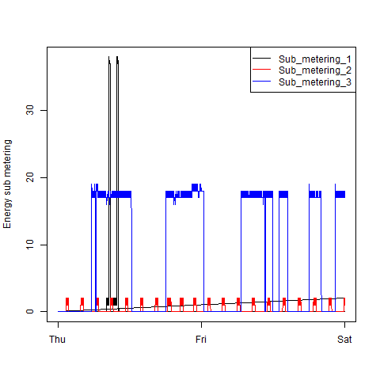
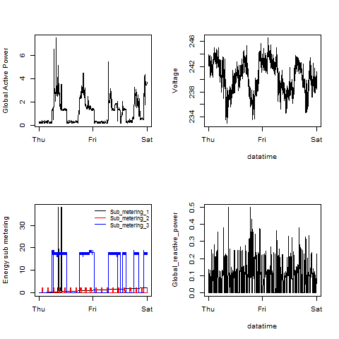

## **Exploratory Data Analysis**
 **Hsin Yu Cheng**    
 **May 09, 2015**    
 
 > Course Project 1.    
 > Dataset : https://archive.ics.uci.edu/ml/machine-learning-databases/00235/    
 > Topic : Examine how household energy usage varies over a 2-day period in February, 2007.    


## **Data Extraction**    
 > Extract data from Internet.    
 > Source : http://stackoverflow.com/questions/3053833/using-r-to-download-zipped-data-file-extract-and-import-data    
 > Source : http://stackoverflow.com/questions/19890633/r-produces-unsupported-url-scheme-error-when-getting-data-from-https-sites    

```{r}
setInternet2(TRUE)
temp <- tempfile()
download.file("https://archive.ics.uci.edu/ml/machine-learning-databases/00235/household_power_consumption.zip",temp)
data <- read.csv(unz(temp, "household_power_consumption.txt"), sep=";")
unlink(temp)
```

### **Load Packages**    
```{r,echo=TRUE}
library(ggplot2)
library(scales)
library(dplyr)
library(tidyr)
```
    
***     
    
### **Summary data**
```{r}
dim(data)
glimpse(data)
```
    
***   
    
### **Calculate Memory**
```{r}
2075259*9*8  # observation * columns * bytes


149418648 / (2^20) # result / (bytes/MB)


# 142.4967 MB : enough for my computer can deal with it.
```
    
***    
    
## **Data Wrangling**
```{r}
Ver <- data

NewDate <- Ver %>% 
  mutate( Date = as.character(Date),
          OK = gsub("/", "-" , Date),
          sample_date = as.Date(OK, format("%d-%m-%Y")),
          Date_Time = paste(sample_date,Time, sep=" ")) %>%
  filter(sample_date == '2007-02-02' | sample_date == '2007-02-01')

NewDate$Date_Time_New <- strptime(NewDate$Date_Time,format = "%Y-%m-%d %H:%M:%S")


#Check how many observations
table(NewDate$sample_date)

# Check class for time and date
class(NewDate$Date_Time_New)

# Write data out and read again to transfer data type
write.csv(NewDate,"C:/Users/Cindy/Documents/CourseData.csv")

mydata <- read.csv("C:/Users/Cindy/Documents/CourseData.csv") # read data from work directory 

mydata$Date_Time_New <- strptime(mydata$Date_Time,format = "%Y-%m-%d %H:%M:%S")

# Check missing value
sum(is.na(mydata))
```
    
***    
    
## **Plot**
#### **Plot 1**    
```{r,eval=FALSE}
png(filename="plot1.png", width=480, height=480)
print(hist(mydata$Global_active_power,
           col = "red",
           xlab = "Global Active Power (kilowatts)",
           main = "Global Active Power"))
dev.off()
```

    
***    
    
#### **Plot 2**
```{r,eval=FALSE}
png(filename="plot2.png", width=480, height=480)
print(plot(mydata$Date_Time_New, 
           mydata$Global_active_power, 
           type = "l",
           ylab = "Global Active Power (kilowatts)",
           xlab = " "))
dev.off()
```

    
***    
    

#### **Plot 3**
```{r,eval=FALSE}
pre <- mydata %>%
  select(Sub_metering_1,Sub_metering_2,Sub_metering_3,Date_Time_New) %>%
  data.frame()


pre$Date_Time_New <- as.character(pre$Date_Time_New)
combind <- gather(pre,Sub_metering,Values,-Date_Time_New)
combind$Date_Time_New <- strptime(combind$Date_Time,format = "%Y-%m-%d %H:%M:%S")

sapply(combind,length)

png("plot3.png",width=480, height=480)
with(combind, plot(Date_Time_New, Values,type = "l", ylab = "Energy sub metering", xlab = " "))
with(subset(combind, Sub_metering == "Sub_metering_1"), lines(Date_Time_New, Values, col = "black"))
with(subset(combind, Sub_metering == "Sub_metering_2"), lines(Date_Time_New, Values, col = "red"))
with(subset(combind, Sub_metering == "Sub_metering_3"), lines(Date_Time_New, Values, col = "blue"))
legend("topright",lty = 1,merge = TRUE,col = c("black","blue", "red"), legend = c("Sub_metering_1", "Sub_metering_2","Sub_metering_3"))

dev.off()
```

    
***    
    
#### **Plot 4**  
```{r,eval=FALSE}
png("plot4.png",width=480, height=480)
par(mfrow = c(2, 2))
with(mydata, {
  plot(Date_Time_New, Global_active_power, xlab =" ", ylab = "Global Active Power", type = "l")
  plot(Date_Time_New, Voltage, xlab = "datatime", ylab = "Voltage",type = "l")
  with(combind, plot(Date_Time_New, Values,type = "l", ylab = "Energy sub metering", xlab = " "))
  with(subset(combind, Sub_metering == "Sub_metering_1"), lines(Date_Time_New, Values, col = "black"))
  with(subset(combind, Sub_metering == "Sub_metering_2"), lines(Date_Time_New, Values, col = "red"))
  with(subset(combind, Sub_metering == "Sub_metering_3"), lines(Date_Time_New, Values, col = "blue"))
  legend("topright",ce = 0.8,bty = "n",lty = 1,merge = TRUE,col = c("black","blue", "red"), legend = c("Sub_metering_1", "Sub_metering_2","Sub_metering_3"))
  plot(Date_Time_New, Global_reactive_power,xlab = "datatime", ylab = "Global_reactive_power",type = "l")
})

dev.off()
```

    
***    
    


