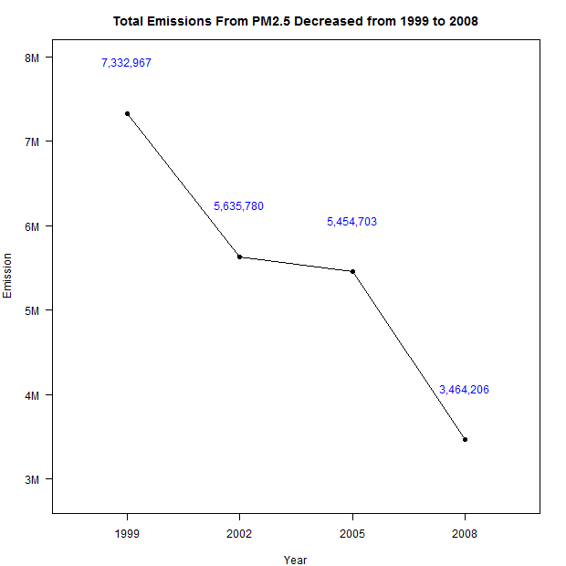
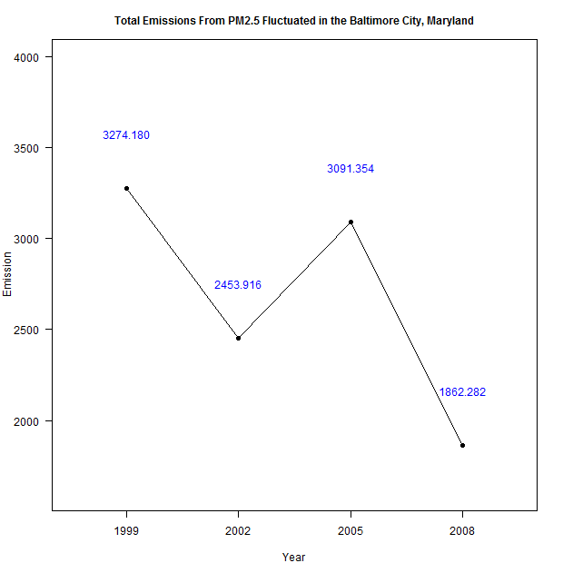
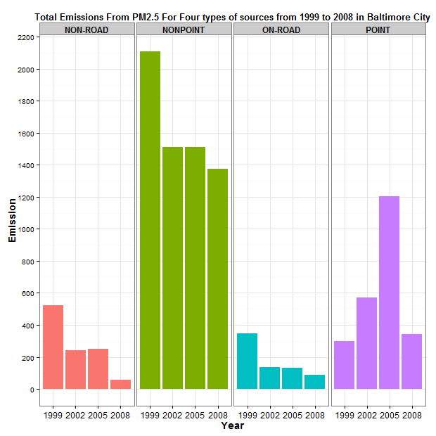
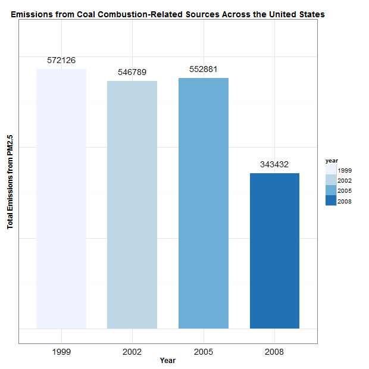
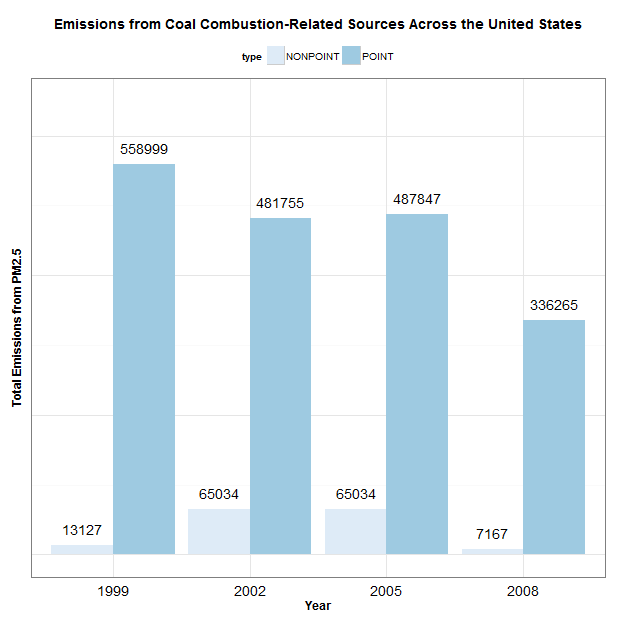
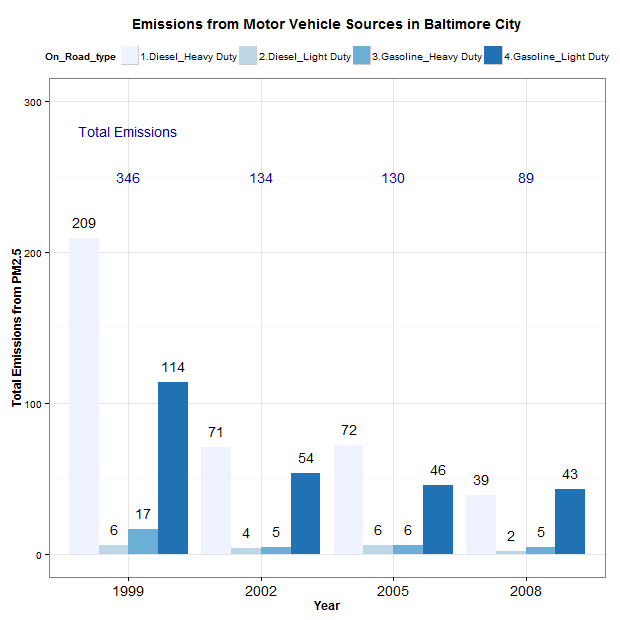
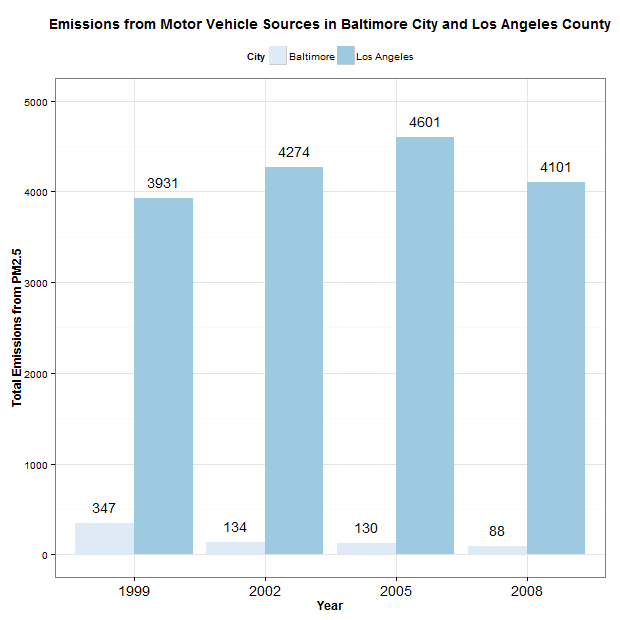

## **Exploratory Data Analysis**
 **Hsin Yu Cheng**    
 **May 20, 2015**    
 
 > Course Project 2.    
 > Dataset : https://d396qusza40orc.cloudfront.net/exdata%2Fdata%2FNEI_data.zip    
 > Topic : Explore the National Emissions Inventory database and see what it say about fine particulate matter pollution in the United states over the 10-year period 1999-2008.         


## **Load Data from work directory**    
```{r,echo=TRUE,eval=FALSE}
NEI <- readRDS("summarySCC_PM25.rds")
SCC <- readRDS("Source_Classification_Code.rds")
```
***    

## **Question 1**

 > Have total emissions from PM2.5 decreased in the United States from 1999 to 2008? Using the base plotting system, make a plot showing the total PM2.5 emission from all sources for each of the years 1999, 2002, 2005, and 2008.    
 >    

### Data Wrangling    
```{r,eval=FALSE}
# Calculate the number of emissions for each of the years 1999, 2002, 2005, and 2008.
Emission <- NEI %>%
    mutate(year = as.factor(year)) %>%
    group_by(year) %>%
    summarise(Sum_Emission = sum(Emissions)) %>%
    data.frame()
```

### Plot the result by using "base plotting system"
```{r,eval=FALSE}
png("plot1.png",width = 620, height = 620)

par(mar = c(4, 4, 3, 2))
plot(Emission$year, 
     Emission$Sum_Emission/1000000,
     type="n",
     xlab = "Year",
     ylab = "Emission",
     main = "Total Emissions From PM2.5 Decreased from 1999 to 2008",
     las = 1,
     yaxt="n",
     ylim = c(2800000/1000000,8000000/1000000),
     boxwex=0.01,
     cex.axis = 1)
pts <- pretty(Emission$Sum_Emission / 1000000)
axis(2, at = pts, labels = paste(pts, "M", sep = ""), las = 1)
points(Emission$year, Emission$Sum_Emission/1000000, pch = 19)
lines(Emission$year, Emission$Sum_Emission/1000000)
text(Emission$year, (Emission$Sum_Emission/1000000) + 600000/1000000, 
     labels = c("7,332,967", "5,635,780", "5,454,703", "3,464,206"), col = 4)

dev.off()
```


***    

## **Question 2**

 > Have total emissions from PM2.5 decreased in the Baltimore City, Maryland (fips == "24510") from 1999 to 2008? Use the base plotting system to make a plot answering this question.     
 >    

### Data Wrangling    
```{r,eval=FALSE}
# Calculate total emissions from PM2.5 in the Baltimore City, Maryland (fips == "24510") from 1999 to 2008
Emission_Maryland <- NEI %>%
    mutate(year = as.factor(year)) %>%
    filter(fips == "24510") %>%
    group_by(year) %>%
    summarise(Sum_Emission = sum(Emissions)) %>%
    data.frame()
```

### Plot the result by using "base plotting system"
```{r,eval=FALSE}
png("plot2.png",width = 620, height = 620)

par(mar = c(4, 4, 3, 2))
plot(Emission_Maryland$year, 
     Emission_Maryland$Sum_Emission,
     xlab = "Year",
     ylab = "Emission",
     main = "Total Emissions From PM2.5 Fluctuated in the Baltimore City, Maryland",
     las = 1,
     boxwex = 0.01,
     ylim = c(1600,4000),
     cex.axis = 1,
     cex.main = 1)
points(Emission_Maryland$year, Emission_Maryland$Sum_Emission, pch = 19)
lines(Emission_Maryland$year, Emission_Maryland$Sum_Emission)
text(Emission_Maryland$year, (Emission_Maryland$Sum_Emission) + 300, 
     labels = c("3274.180", "2453.916", "3091.354", "1862.282"), col = 4)

dev.off()

```

***    

## **Question 3**

 > Of the four types of sources indicated by the type (point, nonpoint, onroad, nonroad) variable, which of these four sources have seen decreases in emissions from 1999-2008 for Baltimore City? Which have seen increases in emissions from 1999-2008? Use the ggplot2 plotting system to make a plot answer this question.         
 >    

### Data Wrangling    
```{r,eval=FALSE}
# Calculate total emissions from PM2.5 in the Baltimore City, Maryland (fips == "24510") from 1999 to 2008 with four types
Emission <- NEI %>%
    mutate(year = as.factor(year)) %>%
    filter(fips == "24510") %>%
    group_by(year, type) %>%
    summarise(Sum_Emission = sum(Emissions)) %>%
    data.frame()
```

### Plot the result by using "ggplot2"
```{r,eval=FALSE}
png("plot3.png",width = 620, height = 620)

ggplot(Emission, aes(x = year, y = Sum_Emission, fill = type)) + 
    geom_bar(position="dodge", stat = "identity", width = 0.9) +
    theme_bw() + 
    guides(fill = FALSE) +
    facet_grid(.~type) +
    theme(strip.text.x = element_text(size = 12, face = "bold")) +
    scale_y_continuous(breaks=pretty_breaks(n = 15)) +
    ylab("Emission") +
    xlab("Year") +
    ggtitle("Total Emissions From PM2.5 For Four types of sources from 1999 to 2008 in Baltimore City") + 
    theme(plot.title = element_text(lineheight = .8, face = "bold", size = 13)) +
    theme(axis.text.x = element_text(size = 12)) +
    guides(color = FALSE) +
    theme(axis.title.y = element_text(face = "bold", size=14)) +
    theme(axis.title.x = element_text(face = "bold", size=14))

dev.off()

```
    
    
***    
      
## **Question 4**

 > Across the United States, how have emissions from coal combustion-related sources changed from 1999-2008?             
 >    

### Data Wrangling    
```{r,eval=FALSE}
# Filter data in SCC table which data includes "Coal"
Coal <- SCC %>%
    mutate(Match = ifelse(grepl("Coal",EI.Sector,ignore.case = T),"Yes","NO")) %>%
    filter(Match == "Yes")


# Subset data in NEI table which includes SCC in SCC table
Coal_related <- NEI[NEI$SCC %in% Coal$SCC,]


# Calculate total emissions from PM2.5 between 1999 and 2008.
Emission <- Coal_related %>%
    mutate(year = as.factor(year)) %>%
    group_by(year) %>%
    summarise(Sum_Emission = round(sum(Emissions))) %>%
    data.frame()
```

### Plot the result by using "ggplot2"
```{r,eval=FALSE}
png("plot4.png",width = 620, height = 620)

ggplot(Emission, aes(x = year, y = Sum_Emission, fill = year, ymax = max(650000))) +
    geom_bar(stat = "identity", width = 0.7) +
    scale_fill_brewer() +
    theme_bw() +
    geom_text(aes(label = Sum_Emission), vjust = -1, position = position_dodge(width = 0.9)) +
    ylab("Total Emissions from PM2.5") +
    xlab("Year") +
    ggtitle("Emissions from Coal Combustion-Related Sources Across the United States") + 
    theme(plot.title = element_text(lineheight=.8, face="bold", size = 14)) +
    theme(axis.ticks = element_blank(), axis.text.y = element_blank()) +
    theme(axis.title.y = element_text(face = "bold", size=12)) +
    theme(axis.title.x = element_text(face = "bold", size=12)) +
    theme(axis.text.x = element_text(size = 14))

dev.off()

```
        
    
    
    
    
***    
        
## **Question 5**

 > How have emissions from motor vehicle sources changed from 1999-2008 in Baltimore City?              
 >    

### Data Wrangling    
```{r,eval=FALSE}
# Subset data including "Mobile" and identify four type vehicles.
Mobile <- SCC %>%
    mutate(Match = ifelse(grepl("Mobile", EI.Sector, ignore.case = T),"Yes","NO")) %>%
    filter(Match == "Yes") %>%
    data.frame() %>%
    mutate(On_Road_type = ifelse(grepl("Diesel Heavy Duty Vehicles", EI.Sector, ignore.case = T),"1.Diesel_Heavy Duty",
                                 ifelse(grepl("Diesel Light Duty Vehicles", EI.Sector, ignore.case = T),"2.Diesel_Light Duty",
                                        ifelse(grepl("Gasoline Heavy Duty Vehicles", EI.Sector, ignore.case = T),"3.Gasoline_Heavy Duty",
                                               ifelse(grepl("Gasoline Light Duty Vehicles", EI.Sector, ignore.case = T),"4.Gasoline_Light Duty",NA)))),
           SCC = as.character(SCC)) %>%
    filter(!is.na(On_Road_type)) %>%
    select(SCC, On_Road_type)


# Subset data in NEI table which includes SCC in SCC table. Also, left join SCC table to include four type vehicles.
Motor_Related <- NEI[NEI$SCC %in% Mobile$SCC,]

Motor_Related <- Motor_Related %>%
     left_join(Mobile, by = "SCC")


# Calculate total emissions from PM2.5 between 1999 and 2008 in Baltimore City.
Emission <- Motor_Related %>%
    filter(fips == "24510") %>%
    mutate(year = as.factor(year)) %>%
    group_by(year, On_Road_type) %>%
    summarise(Sum_Emission = round(sum(Emissions))) %>%
    data.frame()

# Calculate total emissions from PM2.5 for each year of 1999, 2002, 2005 and 2008
Year_Emission <- Emission %>%
    group_by(year) %>%
    summarise(Sum_Emission = round(sum(Sum_Emission))) %>%
    data.frame()
```

### Plot the result by using "ggplot2"
```{r,eval=FALSE}
png("plot5.png",width = 620, height = 620)

ggplot(Emission, aes(x = year, y = Sum_Emission, fill = On_Road_type, ymax = max(300))) +
    geom_bar(position="dodge", stat = "identity", width = 0.9) +
    scale_fill_brewer() +
    theme_bw() +
    geom_text(aes(label = Sum_Emission), vjust = -1, position = position_dodge(width = 0.9)) +
    ylab("Total Emissions from PM2.5") +
    xlab("Year") +
    ggtitle("Emissions from Motor Vehicle Sources in Baltimore City") + 
    theme(plot.title = element_text(lineheight=.8, face="bold", size = 14)) +
    theme(axis.title.y = element_text(face = "bold", size=12)) +
    theme(axis.title.x = element_text(face = "bold", size=12)) +
    theme(axis.text.x = element_text(size = 14)) +
    theme(legend.position = "top") +
    annotate("text", x = "1999", y = 250, label="346",color = "darkblue") +
    annotate("text", x = "1999", y = 280, label="Total Emissions",color = "darkblue") +
    annotate("text", x = "2002", y = 250, label="134",color = "darkblue") +
    annotate("text", x = "2005", y = 250, label="130",color = "darkblue") +
    annotate("text", x = "2008", y = 250, label="89",color = "darkblue")
    
dev.off()

```
    
    
***    

## **Question 6**

 > Compare emissions from motor vehicle sources in Baltimore City with emissions from motor vehicle sources in Los Angeles County, California (fips == "06037"). Which city has seen greater changes over time in motor vehicle emissions?                  
 >    

### Data Wrangling    
```{r,eval=FALSE}
# Subset data including "Mobile" and identify four type vehicles.
Mobile <- SCC %>%
    mutate(Match = ifelse(grepl("Mobile", EI.Sector, ignore.case = T),"Yes","NO")) %>%
    filter(Match == "Yes") %>%
    data.frame() %>%
    mutate(On_Road_type = ifelse(grepl("Diesel Heavy Duty Vehicles", EI.Sector, ignore.case = T),"1.Diesel_Heavy Duty",
                                 ifelse(grepl("Diesel Light Duty Vehicles", EI.Sector, ignore.case = T),"2.Diesel_Light Duty",
                                        ifelse(grepl("Gasoline Heavy Duty Vehicles", EI.Sector, ignore.case = T),"3.Gasoline_Heavy Duty",
                                               ifelse(grepl("Gasoline Light Duty Vehicles", EI.Sector, ignore.case = T),"4.Gasoline_Light Duty",NA)))),
           SCC = as.character(SCC)) %>%
    filter(!is.na(On_Road_type)) %>%
    select(SCC, On_Road_type)


# Subset data in NEI table which includes SCC in SCC table
Motor_Related <- NEI[NEI$SCC %in% Mobile$SCC,]


# Subset data in NEI table which includes SCC in SCC table. Also, left join SCC table to include four type vehicles.
Motor_Related <- Motor_Related %>%
    left_join(Mobile, by = "SCC")


# Calculate total emissions from PM2.5 between 1999 and 2008 in Baltimore and in Los Angeles.
Emission <- Motor_Related %>%
    filter(fips == "24510" | fips == "06037") %>%
    mutate(year = as.factor(year),
           City = ifelse(fips == "24510", "Baltimore", "Los Angeles")) %>%
    group_by(year, City) %>%
    summarise(Sum_Emission = round(sum(Emissions))) %>%
    data.frame()
```

### Plot the result by using "ggplot2"
```{r,eval=FALSE}
png("plot6.png",width = 620, height = 620)

ggplot(Emission, aes(x = year, y = Sum_Emission, fill = City, ymax = max(5000))) +
    geom_bar(position="dodge", stat = "identity", width = 0.9) +
    scale_fill_brewer() +
    theme_bw() +
    geom_text(aes(label = Sum_Emission), vjust = -1, position = position_dodge(width = 0.9)) +
    ylab("Total Emissions from PM2.5") +
    xlab("Year") +
    ggtitle("Emissions from Motor Vehicle Sources in Baltimore City and Los Angeles County") + 
    theme(plot.title = element_text(lineheight=.8, face="bold", size = 14)) +
    theme(axis.title.y = element_text(face = "bold", size=12)) +
    theme(axis.title.x = element_text(face = "bold", size=12)) +
    theme(axis.text.x = element_text(size = 14)) +
    theme(legend.position = "top")

dev.off()

```
    
    
***  


