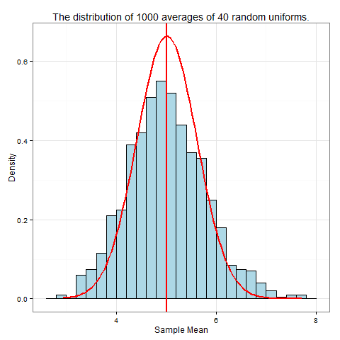

## **Exponential Distribution Simulation and the Central Limit Theorem Project.**    
 **Hsin-Yu Cheng**    
 **July 26, 2015**    

### **Introduction**    
In this project, the goal is to compare the the exponential distribution with the Central Limit Theorem with **mean** and **variance**. The exponential distribution is simulated where lambda value is 0.2, sample size is 40 and 1,000 times simulations. 
 
### **Load Packages**
```{r,message=FALSE}
library(dplyr)
library(ggplot2)
knitr::opts_chunk$set(comment = NA, message = F,cache=TRUE)
```

### **Simulation and calculation of Mean.**
**Simulation**
```{r}
set.seed(123)
forty_number <- replicate(1000,rexp(40, 0.2))
```

**Sample Mean**
```{r}
exponential_mean <- apply(forty_number, 2, mean)
mean(exponential_mean)
```

**Theoretical mean :1/lambda**
```{r}
1/0.2
```
 - The sample mean is close to the theoretical mean, 5.01 and 5 respectivly.    
    
***    
    
### **Calculation variance.**
**Sample variance**    
```{r}
(sd(exponential_mean))^2
```

**Theoretical variance : (1/(lamnda)^2)/40**
```{r}
(1/(0.2)^2)/40
```
 - The sample variance is close to the theoretical variance, 0.6 and 0.625 respectivly.
    
***    
### **The distribution is approximately normal.**
```{r}
plot <- as.data.frame(exponential_mean)

ggplot(plot, aes(x = exponential_mean)) + 
  geom_histogram(binwidth = 0.2, color = 'black', fill = "lightblue", aes(y = ..density..)) +
  theme_bw() +
  stat_function(fun = dnorm, color = "red", size = 1,
                args = list(mean = mean(exponential_mean), sd = (sd(exponential_mean))^2)) +
  geom_vline(xintercept = mean(exponential_mean), size = 1, color="red") +
  xlab("Sample Mean") +
  ylab("Density") +
  ggtitle("The distribution of 1000 averages of 40 random uniforms.")
```
    

 * The distribution of simulation is close normal. The vertical red line is the sample mean at 5.01. The bell curve means that it is a normal dsitribution.

 