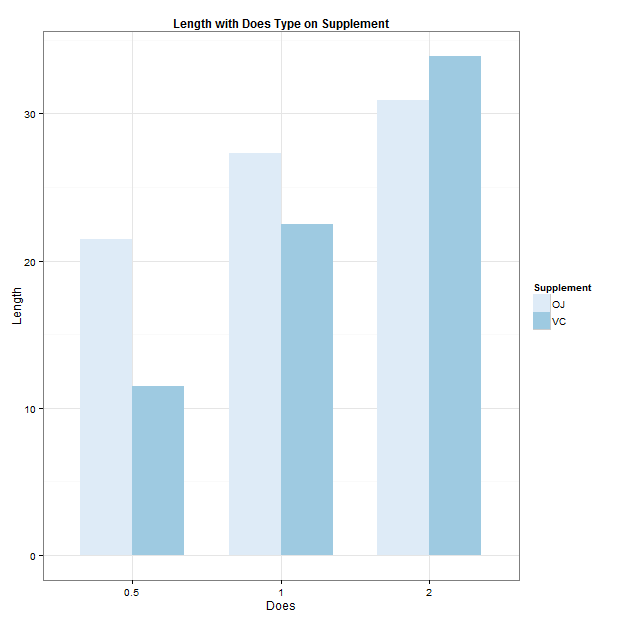

# **Tooth Growth Data Analysis.**             

 **Hsin-Yu Cheng**    
 **July 26, 2015** 

## Introduction    
The goal of the project is to explore and analyze the ToothGrowth data in the R. Also, to process hypothesis tests to compare tooth growth by supplement and dose.    

ToothGrowth data is the effect of vitamin C on tooth growth in guinea pigs. It contains 60 observations and 3 variables:    
1. len : tooth length of guinea pigs.           
2. supp : supplement type (VC or OJ).       
3. does : dose in milligrams.       

## Load Packages    
```{r,message=FALSE}
library(ggplot2)
library(dplyr)
library(tidyr)
knitr::opts_chunk$set(comment = NA, message = F, cache=TRUE)
```
   
***   
    
## **Exploratory Data Analysis**
**Data Summary and Transformation**    
```{r}
Tooth <- ToothGrowth %>%
  mutate(dose = as.factor(dose),
         supp = as.factor(supp)) %>%
  rename(length = len, Supplement = supp)

summary(Tooth)
```
 * The does variable containa 3 different doeses, 0.5, 1, and 2 milligrams respectively.    
 * There are two type supplement. Orange juice(OJ) contains 30 sample size and ascorbic acid(VC) contains 30 sample size.   
 
     
**Descriptive Exploration**  
```{r}
ggplot(Tooth, aes(x = dose, y = length, fill = Supplement)) +
  geom_bar(stat = "identity", position = "dodge", width=0.7) +
  theme_bw() +
  scale_fill_brewer() +
  ylab("Length") +
  xlab("Does") +
  ggtitle("Length with Does Type on Supplement") + 
  theme(plot.title = element_text(lineheight=.8, face="bold", size = 12))
```
 
 * As can be seen from the graph, it shows a positive trend with does on two supplement. When the does increases, the length also increases on the supplement of orange juice and ascorbic acid.       
 
 * In general, the length with orange juice supplement is higher than that with ascorbic acid supplement. However, with 2 milligrams, it shows opposite length result.    
 
 * In the following hypothesis, we will test the does achieves significate different effect on tooth length. Also, we will test whether supplement type would influence tooth lenght with the statistical difference.    
    
***         

## **Hypothesis Tests**   

T distribution is used for the hypothesis tests. We **assume** that guinea pigs were randomly assigned to one of the groups and they were sampled from a nearly normal population.    

**Tooth length with 3 doeses.**

```{r}
does <- Tooth %>% 
  select(-Supplement) %>%
  mutate(dose = ifelse(dose == "0.5","dose_level1",
                       ifelse(dose == "1", "dose_level2","dose_level3"))) %>%
  spread(dose, length) 

level1 <- does %>% select(dose_level1) %>% filter(!is.na(dose_level1))
level2 <- does %>% select(dose_level2) %>% filter(!is.na(dose_level2))
level3 <- does %>% select(dose_level3) %>% filter(!is.na(dose_level3))

dose_data <- cbind(level1, level2, level3)

t.test(dose_data$dose_level1 , dose_data$dose_level2, paired = FALSE)
t.test(dose_data$dose_level1 , dose_data$dose_level3, paired = FALSE)
t.test(dose_data$dose_level2 , dose_data$dose_level3, paired = FALSE)
```

 * As can be seen from the t-test result, the p values between dosese are all smaller than 0.05%, which means that they all achieve significate level and null hypothesis is rejected. The length means are significantly different between different dose with 0.5, 1, and 2 milligrams.    

**Tooth length with 2 supplement.**
```{r}
t.test(length ~ Supplement, Tooth, var.equal = FALSE)
```

 * As can be seen from the t-test result, the p value is 0.06, which is larger that 0.05. It does not achieve significant difference and the null hypothesis is not rejected. It means that the length mean show no significantly difference betwee orange juice and ascorbic acid.    
    
***    
    

## **Conclusions**    
The mean of tooth length are significantly different between 3 level dose, namely 0.5, 1, and 2 milligrams. However, it does not show difference when using orange juice and ascorbic acid.      


