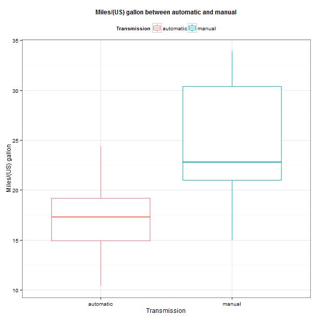

## **Motor Trend Analysis**
 **Hsin Yu Cheng**    **May 24, 2015**    
     
#### **Executive Summary**    
    
Motor Trend, a magazine about the automobile industry, is interested in the relationship between a set of variables and miles per gallon. The purpose of the data analysis is to see whether miles per gallon are significantly different when people use automatic and manual transmission. For the final result, statistics supoorts that manual transmission is better than automatic transmission in miles per gallon.     
    
```{r,include=FALSE}
library(dplyr)
library(ggplot2)
library(scales)
```
        
#### **Load Data and check data information**        
```{r,eval=FALSE}
data(mtcars)
str(mtcars)
```     
    
"mtcars" includes 32 observations and 11 variables.    
    
```{r}
mtcars <- mtcars %>% mutate(Transmission = ifelse(am == 1, "manual", "automatic"))
```
       
#### **Exploratory analysis**          
       
Scatterplot between variables. 
    
```{r,eval=FALSE}
pairs(mtcars)
```        
1.See Figure 1 in appendix.         
2.It shows relationships between variables.          
        
***    
               
         
#### **Is an automatic or manual transmission better for MPG?**    
    
```{r,eval=FALSE}
ggplot(mtcars, aes(x = Transmission, y = mpg, colour = Transmission)) + 
  geom_boxplot() + theme_bw() + ylab('Miles/(US) gallon') +
  theme(legend.position = "top") +
  ggtitle("Miles/(US) gallon between automatic and manual") + 
  theme(plot.title = element_text(lineheight = .8, face = "bold", size = 12))
```

1.See Figure 2 in appendix.      
2.Visualization shows that manual transmission is better than automatic transmission.                      
        
***    
    
#### **Quantify the MPG difference between automatic and manual transmissions?**    
```{r}
mean <- mtcars %>% group_by(Transmission) %>% summarise(Transmission_Mean = mean(mpg))    
```   
           
#### **Statistics Evidence**
```{r}
t.test(mpg ~ Transmission, mtcars)    
```    

**Interpretation** :     
1.From the result of t-test, the p value is 0.001374 < 0.05. It achieves significant level. It means that there is significant difference among manual and automatic transmission on dependent variable "Miles per gallon".**        
2.Miles per gallon of **manual transmission** is better than that of  **automatic transmission**, 24.39 and 17.15 respectively.    

               
***    
              
#### **Regression Model**
    
**1. Variable selection : Use "backward method"**     
```{r,tidy=TRUE,results='hide'}
mydata <- mtcars %>% 
    mutate(cyl = as.factor(cyl), vs = as.factor(vs), gear = as.factor(gear), carb = as.factor(carb )) %>% select(-am)

full.model <- lm(mpg~., mydata)
reduced.model <- step(full.model, direction = "backward")
```
It shows that the best model includes three variables, namely Transmission(am), hp, cyl and wt.    
    
**2. Best model**        
```{r,fig.width=16, fig.height=6}
Best.model <- lm(mpg~ Transmission + hp + wt + cyl, data = mydata)
summary(Best.model)
AIC(full.model)
AIC(Best.model)
```

**Interpretation :**    
1.The value of **Adjusted R-squared is 84.01%**. It represents that 84.01% of the total variance in the "mpg(Miles per gallon)" around its mean is accounted for by Transmission, hp, wt and cyl variables.    
2.For hp, wt and cy16 variables, the p values are 0.02693 < 0.05, 0.00908 < 0.05, and 0.04068<0.05. They all **achieve significant level** and show negative relationship with mpg.    
3.For hp(horsepower), the coefficient -0.03211 indicates that for every additional **horsepower** you can expect **mpg to decrease by an average of 0.03211 miles per gallon.**
4.For wt(Weight), the coefficient -2.49683 indicates that for every additional **Weight(lb/1000)** you can expect **mpg to decrease by an average of 2.49683 miles per gallon.**
5.For cyl6(6 cylinders), compared to 4 cylinders(the reference level, the coefficient -3.03134 indicates that 6 cylinders is less than 4 cylinders in miles per gallon at 3.03134.    
6.**AIC of best model improves from 154.47(full model) to 169.22 and adjusted R-squared of best model improves from 77.9%(full model) to 84.01%.**         
     
***
        
#### **Regression Residual Plots of Best Model.**    
```{r,eval=FALSE}
par(mfrow=c(2, 2))
plot(Best.model)
```
1.See Figure 3 in appendix.     
2.**Interpretation : The residuals are normally distributed and homoscedastic.**    
    
     
#### **Diagnostics : Exam influential points.**
```{r,eval=FALSE}
library(car)
influence.measures(Best.model)
outlierTest(Best.model)
```
It shows that observation 31, 16, and 20 would be influential points. However, it would be better to understand more the observations before deleting them.    
    
***        
        
### **Appendix**     
  
    
 *Fig 1.Exploratory analysis : Relationships Between Variables.*    
     
***     
     
    

 *Fig 2. Miles per gallon Between Transmissions*    
    
***     
     
     
    
 *Fig 3. Regression Residual Plots of Best Model.*
    
***    
     
