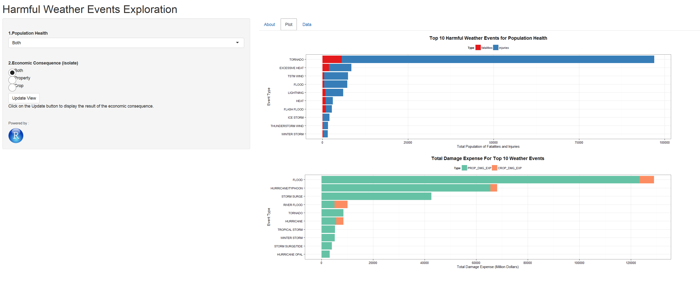

Developing Data Products - Course Project
========================================================
 **Hsin-Yu Cheng**    
 **June 21, 2015**
 
 Shiny  App  on  Strom  Data  Exploration


The Interactive Platform - Shiny       
========================================================
type: prompt
 - [Shiny io](https://www.shinyapps.io/) : Share the application online.    
 - [Introduction of Shiny.](http://shiny.rstudio.com/)      
 - Processed R code can be seen on [Github](https://github.com/HY-CHENG2015/datasciencecoursera/tree/master/9.Developing_Data_Products/ShinyApp).    
Data set
========================================================
type: prompt
 - U.S. National Oceanic and Atmospheric Administration's (NOAA) [storm database](https://d396qusza40orc.cloudfront.net/repdata%2Fdata%2FStormData.csv.bz2).
 - Impact :    
1. Human health on fatality and injury.     
2. Damage Expense on property and crop.    
 - Between 1950 and 2011 in the United States.    

Data Summary
========================================================
type: prompt
<style>

.reveal code.r{ 
  font-size:16px;
} 

</style>

```r
library(dplyr)
data <- read.csv("data.csv")
names(data %>% select(evtype, fatalities, injuries, propdmg, propdmgexp,cropdmg,cropdmgexp))
```

```
[1] "evtype"     "fatalities" "injuries"   "propdmg"    "propdmgexp"
[6] "cropdmg"    "cropdmgexp"
```

How to use the Web App    
========================================================
type: prompt


[Visit the Application](https://hy-cheng.shinyapps.io/ShinyApp)
